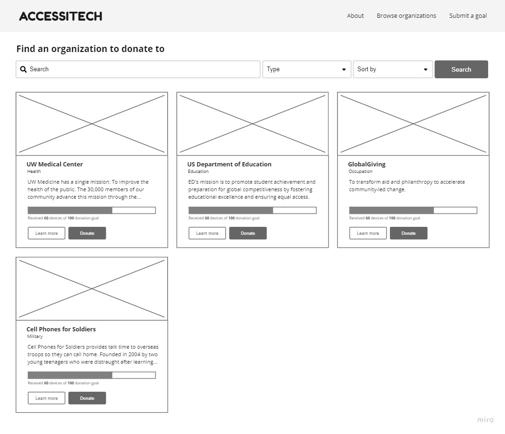

## Problem

The high cost of electronic devices makes them inaccessible to many lower income minority groups. This digital divide is recognized and defined as “a social issue referring to the differing amount of information between those who have access to the Internet and those who do not have access” (Digital Divide). In an increasingly electronic world, this further puts individuals in these groups at a disadvantage when it comes to medical health, educational, and occupational opportunities, since they don’t have access to necessary electronic devices. Existing solutions, such as [Close the Gap](https://www.close-the-gap.org/donate), are aimed at collecting electronic donations from businesses to donate to various organizations. Other solutions, such as the one provided by the [EPA](https://www.epa.gov/recycle/electronics-donation-and-recycling#why), encourage individuals to recycle their electronic devices at recycling centers. There seems to be no existing solutions that allow individuals to directly donate their unneeded electronic devices directly to organizations of their choice, including schools, medical clinics, and employment services. Thus, millions of devices that could be donated and reused by underprivileged groups are being missed out on. How can we connect device donors to these organizations so that we can help low income individuals achieve access to technology?

## Solution
Accessitech aims to develop a solution by acting as a bridge between technology device seekers and donors. We strive to make electronic devices and other technology accessible by making it easy to connect device donors directly to organizations that have mission statements that align with their values. Through this method, we hope to help people in need get access to technology.

### Landing page:
On the landing page, the user is greeted with the goal of Accesitech - we want to help them find an organization they can donate their devices to or help their organization meet their device donation goals. They then have two interaction choices where they can choose to browse organizations they can donate to or submit a device donation goal for their organization. When the user clicks “Browse organizations”, they will be moved to a page where they can view different organizations to help them make an informed decision about what organizations they want to donate to. On the other hand, when the user clicks on “Submit a goal”, they will be redirected to a form on the site where they will fill out information about their organization and devices that they need. This page allows the user to easily determine which part of the site they need to navigate to.

_Browse organization page before filter_

_Browse organization page after filter_

### Browse organizations page:
To start off, when a donor clicks on “Browse organizations” on the landing page they will be led to the organizations page where they will be able to find an organization that they want to donate to based on their values. They can search for an organization by it’s name directly, or use the drop down menus. When they click on the “Type” drop down menu, they will have the option to filter between health, education, occupation and military. In addition, the donor can further filter their results by using the “Sort by” drop down menu which has options of default, high to low donation progress reached, low to high donation progress reached, and by date posted. After these “Type” and “Sort by” choices are made and the user clicks on the “Search” button, the page will update with the filters the donor has chosen to help them easily narrow down and identify organizations that align with their values and help them make informed decisions about who they may want to donate to. When the donor clicks on “Learn more” they will be directed to the individual organization’s page to allow them to do more research on the organization to see if they are a good fit for them. Then when they click “Donate” they will be led to a form where they can fill out the devices they are wanting to donate. Additionally, once an organization meets their donation goal, their listing will be removed from this page. If the organization is still in need, they may submit another organization goal and a new listing for their organization will be displayed.

### Individual organization page:
Once a donor selects the “Learn more” button for a specific organization, they are taken to that individual organization’s page. On this page is the organization name, devices needed, and mission statement on the right hand side of the page, as well as the logo image and contact information (phone, email, address) on the left hand side of the page. These resources allow the donor to reach out to an organization if they have more questions. Below the contact information is a progress bar that shows how many devices out of the organization’s donation goal have been received, as well as a “Donate” button. When the donor clicks on “Donate” they will be directed to a form that they fill out with devices they are willing to donate.

_Example of valid and complete device donation form that can be submitted_

_Example of device donation form with errors that cannot be submitted_

### Device donation page:
On the device donation page, the donor can see on the top of the page where they have decided to make a donation to. The donor must fill in the required information like first and last name, phone number, and the address. This page also asks the donor to add a device type and quantity of that particular device that the donor wants to donate. The add device portion will reset when they click “Add device” and they can add another device type they want to donate if they want to.

In the beginning, the “Donation Summary” will have no device or quantities added. When the donor clicks on “Add device”, the “Donation Summary” will update with the device(s) they have chosen to donate. They also have the option to remove a device from the “Donation Summary” if they make a mistake or do not want to donate the device anymore. By clicking “Remove” the “Donation Summary” will update by removing the device from the list. In order to continue, the donor has to check mark all the three requirements that check if all devices globally meet requirements for donation which can be seen in the wireframe. 

If any of the form fields are invalid or incomplete, those portions will be highlighted in red and messages will appear next to them to guide the donor in correctly filling out the form. Once everything looks good and all the conditions are met, the donor clicks “Confirm donation” which will lead them to a confirmation page thanking them for their donation. The progress bar on the “Browse organizations” page will also update for the organization depending on the number of devices donated.

### Device confirmation page:
After clicking “Confirm donation” on the previous page, the website will now take the user to the device confirmation page. This page thanks the donor for their donation and gives them instructions on where to donate their device. There is also a full summary of the type and number of devices they want to donate and the option to cancel their donation for whatever reasons they might have. A message saying “Donation has been successfully canceled” will show below the donation summary if the “Cancel donation” button is clicked, and the button will disappear. Additionally, the progress bars will remove the amount of devices that were in the donation summary canceled. 

### Submit an organization page:
As an organization, they can select the “Submit a goal” button from either the landing page or in the navigation bar at the top of the page to be taken to a page for submitting an organization goal. On this page, the organization can fill out the name and type of the organization they are, their contact information (location, phone, email), needed devices, donation goal, and mission statement. At the end of the form, the organization can then select the “Submit organization goal” button at the bottom of the page and be redirected to the “Browse organizations” page where a new listing will appear for that organization and its device needs. However, if any of the form fields are invalid or incomplete, those portions will be highlighted in red and messages will appear next to them to guide the organization in correctly filling out the form. Once the organization has submitted their goal, they will not be able to altar or remove their organization card. If their donation goal has been achieved, their organization card will be removed from the “Browse organizations” page and they may submit another goal.

## References
“Digital Divide - ICT Information Communications Technology.” Internet World Stats, www.internetworldstats.com/links10.htm.

“Electronics Donation and Recycling.” EPA, Environmental Protection Agency, 9 Oct. 2020, www.epa.gov/recycle/electronics-donation-and-recycling.

“Support Us.” Donate - Close The Gap, www.close-the-gap.org/donate. 
