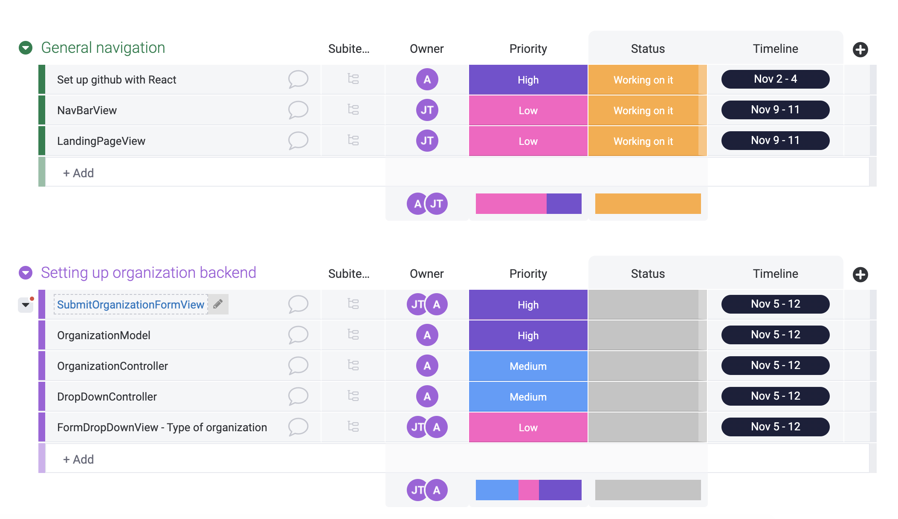
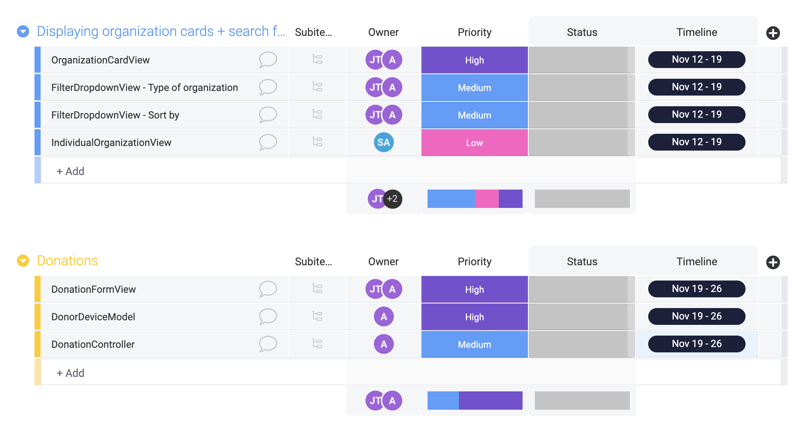
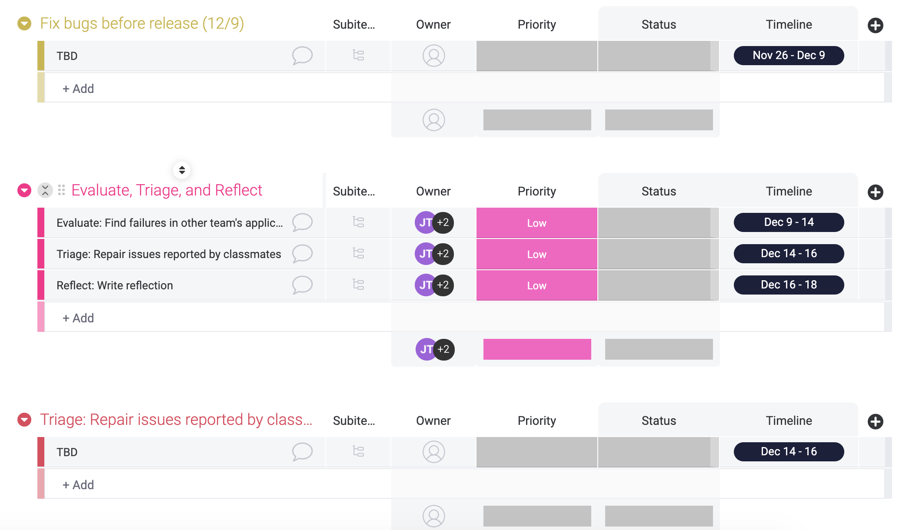

# Plan

## 1. How will you coordinate you work?

Suyash Ahuja, our PM, will be coordinating the work. This responsibility is defined by his role on the team. He will be in charge of task management, as well as preparing weekly to-do lists. Additionally, he will be checking in with each team member and their progress on their assigned tasks, and providing support for any kinds of difficulties that may come up. Our team will continue to meet during regularly scheduled class times on Mondays and Wednesdays from 3:30pm - 5:20pm. We will also have extra meeting times on Thursdays between 7:00pm - 8:00pm if needed. Suyash will also be responsible for planning agendas for these meetings.

## 2. What tools will you use to communicate?
- Our team will be using **Facebook Messenger** for general communication, questions, and updates. This has been our main channel of communication, and is the most familiar option to all of our team members for these general purposes which makes it better than using discord. Some alternatives include Discord and Slack, but our teammates are less familiar and responsive on these platforms.
- However, for meetings, we will continue to use **Discord** because this effectively allows us to discuss, screen-share, and send links simultaneously. An alternative for this would be Zoom, but it does not have the same functionalities since it does not save previous messages, while Discord does.
- We will continue to use **Google Drive** to collaborate on any necessary documents, as well as agendas, because it is easily accessible to everyone, and allows for synchronous work. An alternative to this would be to work directly on GitHub, but this option is not as synchronized.
- We will also use [**Monday**](https://accessitech.monday.com/boards/832283323) for task management, rather than Trello, because it allows us to keep track of and assign tasks to people with due dates without a subscription, unlike Trello. 
- For code sharing, we will be using **Visual Studio Code**, because this is what the developer will be using to code the project, and it has an extension for code sharing. An alternative for this would be CodeShare, but this would be less convenient because the code would have to be copied over.

## 3. Who will own components in your architecture?
- Views: Ashlea (software dev) and Joanna (designer) will be responsible for the view components.
- Models: Ashlea (software dev) will be responsible for the model components.
- Controllers: Ashlea (software dev) will be responsible for the controller components.

### Component Breakdown:
- NavBarView: Joanna (designer)
- LandingPageView: Joanna (designer)
- SubmitOrganizationFormView: Ashlea (developer)
- BrowseOrganizationsView: Ashlea (developer)
- OrganizationCardView: Joanna (designer)
- IndividualOrganizationView: Suyash
- DonationFormView: Ashlea (developer)
- FormDropDownView: Ashlea (developer)
- FilterDropDownView: Ashlea (developer)
- OrganizationModel: Ashlea (developer)
- DonorDeviceModel: Ashlea (developer)
- DonationController: Ashlea (developer)
- OrganizationController: Ashlea (developer)
- DropDownController: Ashlea (developer)

We decided that Ashlea would own the majority of the views, as well as the models and controllers, because she will be the main person responsible for coding, as per her role as developer. We gave Joanna, our designer, ownership over some of the views, as she knows the design best and how the product should look to the user. Suyash, our PM, was given ownership over one view, to distrubute the work and allow for contribution from everyone.

## 4. Timeline

We have divided our project into the following phases:
* General navigation
* Setting up organization backend
* Displaying organization cards + search feature
* Donations
* Fix bugs before release
* Evaluate, triage, and reflect

We categorized the components of our project and defined their respective phases. As shown above, each component has been assigned to an individual owner. Timeframes for each component are defined to the right, under "timeline". We plan to deliver the final project on **December 16th, 2020**. We plan to have a working model to present to the class and for the peer review ready by the deadline of Homework 7 - our target is to have it completed by **December 6th, 2020**. This gives us some extra flexibility in the proceeding weeks to implement the changes based on any bugs that are reported.
